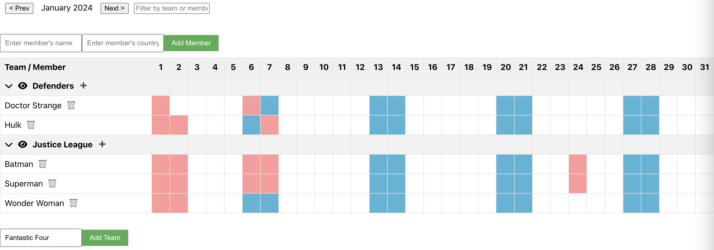

# vacal - Vacation Calendar

[Vacal](https://vacal.antonlarin.com) is a modern tool for managing calendar-based scheduling processes.

* Manage teams and team members effectively.
* Organize and track vacation days.
* Visualize vacation days, weekends, and public holidays in an intuitive interface.
* Ideal for both local and distributed teams, enhancing team coordination and planning.

## Technologies
* Uses Python [FastAPI](https://github.com/tiangolo/fastapi) on the backend and [MongoDB](https://github.com/mongodb/mongo) as storage.
* [ReactJS](https://github.com/facebook/react) on the frontend.

## Screenshot

## Run locally with only one command (Docker Compose)
* `./run_docker_compose_local.sh`
* Access on http://localhost:3000

## Production deployment
### MongoDB
* Deploy or use existing MongoDB server with enabled authentication. 
### Backend
* Use prebuilt Docker container from this repository [packages](https://github.com/larinam/vacal/pkgs/container/vacal).
* Provide to container relevant environment variables defined in [`backend/.env.template`](https://github.com/larinam/vacal/blob/main/backend/.env.template). 
### Frontend
* Create `.env.production.local` from [`frontend/.env.example`](https://github.com/larinam/vacal/blob/main/frontend/.env.example). 
* Build with `npm run build`. 
* Use built static sources from the `build` folder.
### Authentication
#### User/Password authentication
* For USERNAME/PASSWORD AUTHENTICATION generate a string like this run: `openssl rand -hex 32` and set `AUTHENTICATION_SECRET_KEY` in the environment.
#### Telegram authentication
* See https://core.telegram.org/widgets/login
* Configure TELEGRAM_BOT_TOKEN and TELEGRAM_BOT_USERNAME in the backend .env
* Tip for local testing: https://stackoverflow.com/questions/61964889/testing-telegram-login-widget-locally
#### Multi-factor authentication
* The backend uses TOTP-based MFA via `pyotp`.
* Every user has an `mfa_secret` generated automatically and the `/token` endpoint enforces MFA.
* On the first login, the server returns a QR code provisioning URI so you can scan it with your authenticator app and confirm the OTP.
* The login page first asks for your username and password. If MFA isn't configured yet,
  you'll see a QR code to scan and an OTP field. Returning users are prompted for
  their one-time code after submitting credentials.

### Calendar integration
Teams expose a read-only iCalendar feed. Subscribe using
`/calendar/{team_id}?user_api_key={user_api_key}` in external calendars like
Google Calendar. The user API key is generated for each user and allows access
to be revoked when the user is removed. The feed returns
all stored absences, so no dates need to be provided in the subscription URL.
